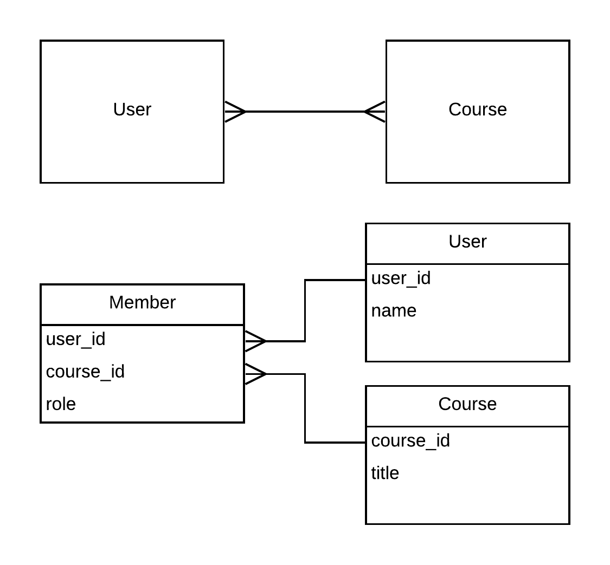

# Roster

Implemented a project from the Coursera course "Using Databses with Python" using Golang.

I learned about how to model many-many relationships in a database, by creating a [junction table](https://en.wikipedia.org/wiki/Many-to-many_(data_model) ), in this case the "Member" table, which manages two many-one relationships via foreign keys and is a location for further data about the relationship. In this case, a user could be a member of many classes as either a student (role = 0) or an instructor (role = 1).

Due to this data model, care must be taken to ensure the associated User and Course (along with associated user_id and course_ids) have been inserted already before a Member can be added.

I also learned about Datadog's wonderful [go-sqlmock]("github.com/DATA-DOG/go-sqlmock") library that let me mock my sqlite database during testing.

